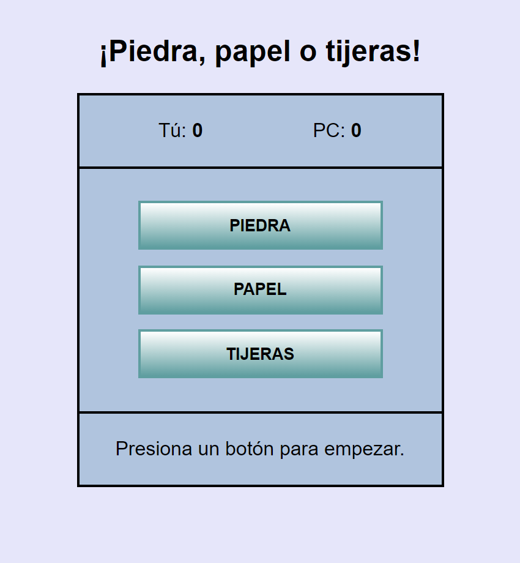

# Piedra, papel o tijeras
- [Descripción](#descripción)
- [Funcionalidades](#funcionalidades)
- [Conceptos Utilizados](#conceptos-utilizados)
- [Vista Previa](#vista-previa)

## Descripción
Juego de piedra, papel o tijeras usando HTML, CSS y JavaScript.  

**Pruébalo aquí:** <a href="https://sergioqa123.github.io/piedra-papel-tijeras/">https://sergioqa123.github.io/piedra-papel-tijeras/</a>

## Funcionalidades
- **Interfaz de usuario interactiva:** Permite a los jugadores seleccionar entre piedra, papel o tijeras.
- **Puntajes:** Muestra el puntaje actual del jugador y de la computadora.
- **Determinación de resultados:** Evalúa y muestra el resultado de cada ronda (ganar, perder o empatar).
- **Modo de juego:** Continuar o Reiniciar el juego luego de haber perdido.
- **Actualización dinámica del DOM:** Actualiza los textos y estilos de los botones según el estado del juego.

## Conceptos Utilizados
- **Manejo del DOM:**
  ```javascript
  let tuScoreTexto = document.querySelector("#tuScore");
- **Eventos de clic en los botones:**
  ```javascript
  boton1.onclick = jugarPiedra;
  boton2.onclick = jugarPapel;
  boton3.onclick = jugarTijeras;  
- **Objetos para modelar datos:** Se utilizan arrays de objetos para las opciones y los modos de juego.
  ```javascript
  const objetos = [
    { nombre: "piedra", ganaContra: "tijeras", pierdeContra: "papel" },
    { nombre: "papel", ganaContra: "piedra", pierdeContra: "tijeras" },
    { nombre: "tijeras", ganaContra: "papel", pierdeContra: "piedra" }
  ];
  const modos = [
    { nombre: "inicio",
      textoBotones: ["PIEDRA", "PAPEL", "TIJERAS"],
      funcionesBotones: [jugarPiedra, jugarPapel, jugarTijeras] },
    { nombre: "perdiste",
      textoBotones: ["CONTINUAR", "REINICIAR", "REINICIAR"],
      funcionesBotones: [continuar, reiniciar, reiniciar]
    }
  ];
- **Funciones para jugar, continuar y reiniciar:**
  ```javascript
  function jugarPiedra() {
      jugar(0);
  }
  
  function jugarPapel() {
      jugar(1);
  }
  
  function jugarTijeras() {
      jugar(2);
  }

  function jugar(objeto) {
    let eleccionPc = pcElige();
    let eleccionTu = objetos[objeto];
    if(eleccionTu.nombre == eleccionPc.pierdeContra) {
        resultado = "Ganaste\n";
        tuScore++;
    } else if (eleccionTu.nombre === eleccionPc.ganaContra) {
        resultado = "Perdiste\n";
        pcScore++;
        modoActual++;
        decidir();
    } else {
        resultado = "Empate\n";
    }
    tuScoreTexto.innerText = tuScore;
    pcScoreTexto.innerText = pcScore;
    resultadoTexto.innerHTML = "<strong>" + resultado + "</strong><br><br>";
    resultadoTexto.innerHTML += "Tú escogiste:" + eleccionTu.nombre + ". <br> PC escogió: " + eleccionPc.nombre;
  }
  
  function continuar() {
      modoActual--;
      cargarValores();
      resultado = "Presiona un botón para jugar.";
      resultadoTexto.innerText = resultado;
  }
  
  function reiniciar() {
      tuScore = 0;
      pcScore = 0;
      tuScoreTexto.innerText = tuScore;
      pcScoreTexto.innerText = pcScore;
      continuar();
  }
## Vista Previa
|Escritorio|Movil|
|---|---|
|  |  |
